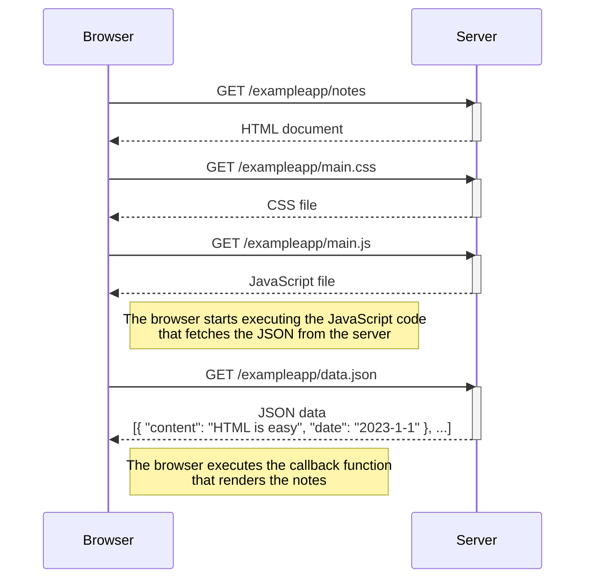

```mermaid
sequenceDiagram
    participant Browser
    participant Server

    Browser->>Server: GET /exampleapp/notes
    activate Server
    Server-->>Browser: HTML document
    deactivate Server

    Browser->>Server: GET /exampleapp/main.css
    activate Server
    Server-->>Browser: CSS file
    deactivate Server

    Browser->>Server: GET /exampleapp/main.js
    activate Server
    Server-->>Browser: JavaScript file
    deactivate Server

    Note right of Browser: The browser starts executing the JavaScript code<br>that fetches the JSON from the server

    Browser->>Server: GET /exampleapp/data.json
    activate Server
    Server-->>Browser: JSON data<br>[{ "content": "HTML is easy", "date": "2023-1-1" }, ...]
    deactivate Server

    Note right of Browser: The browser executes the callback function<br>that renders the notes

```
