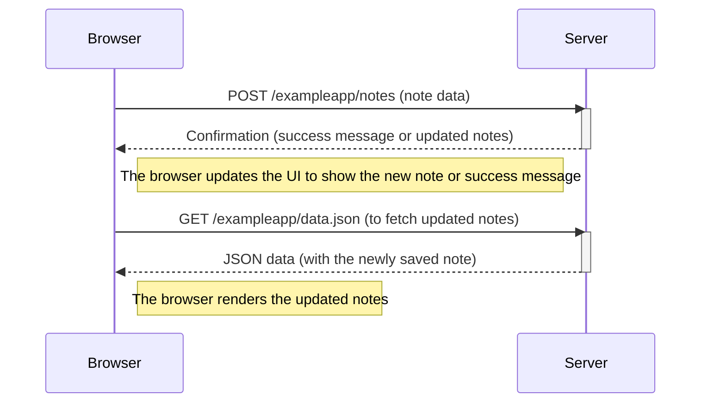

```mermaid
sequenceDiagram
    participant Browser
    participant Server

    Browser->>Server: POST /exampleapp/notes (note data)
    activate Server
    Server-->>Browser: Confirmation (success message or updated notes)
    deactivate Server

    Note right of Browser: The browser updates the UI to show the new note or success message

    Browser->>Server: GET /exampleapp/data.json (to fetch updated notes)
    activate Server
    Server-->>Browser: JSON data (with the newly saved note)
    deactivate Server

    Note right of Browser: The browser renders the updated notes
```
