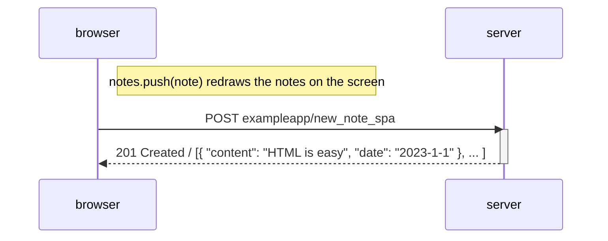

```mermaid
sequenceDiagram
    participant browser
    participant server

    Note right of browser: notes.push(note) redraws the notes on the screen
    browser->>server: POST exampleapp/new_note_spa
    activate server
    server-->>browser: 201 Created / [{ "content": "HTML is easy", "date": "2023-1-1" }, ... ]
    deactivate server

```
